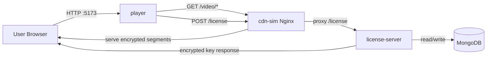

# Architecture Overview

Tài liệu này mô tả kiến trúc runtime dùng cho demo NT219 (DRM + CDN + Player).

## Thành phần chính

- `player`: React + Shaka Player, chạy trên browser.
- `cdn-sim`: Nginx edge, phân phối `/video/*`, proxy `/license`.
- `license-server`: Node.js API cấp JWT và DRM license.
- `db`: MongoDB lưu key/audit (hoặc fallback PoC mode nếu DB không sẵn sàng).

## Sơ đồ kiến trúc (Mermaid)



## Luồng E2E chính

1. Browser mở `player`, chọn manifest DRM.
2. Player tải manifest/segment từ `cdn-sim`.
3. CDM phát sinh license challenge.
4. Player gọi `/license` (qua `cdn-sim`).
5. `license-server` xác thực JWT + entitlement + nonce.
6. Server trả về key đã bọc RSA-OAEP.
7. CDM giải mã trong runtime và render frame đầu.

## Cổng dịch vụ mặc định

- Player: `5173`
- CDN HTTP: `8080`
- CDN HTTPS: `8443`
- License Server: `3000`
- MongoDB: `27017`

## Vận hành hiện tại

- Không dùng Docker Compose cho luồng chính.
- `license-server` được quản lý bởi `systemd` trên VM app.
- Nginx edge chạy trên VM edge, MongoDB trên VM db (hoặc 1 VM gộp cho demo nhỏ).
- Sau khi service đã chạy, kiểm tra nhanh bằng smoke test từ repo root:

```bash
bash infra/smoke-test.sh
```
